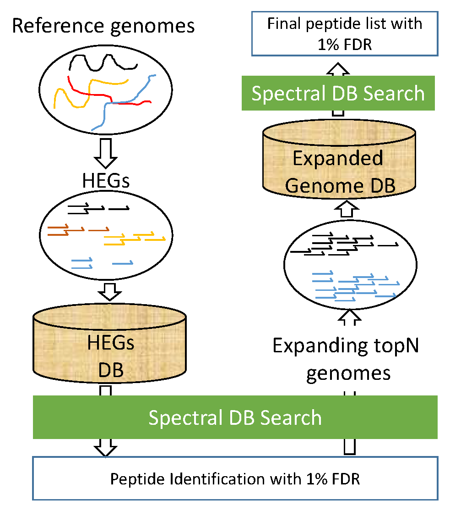

# HAPiID
HAPiID (pronunciation: Happy ID). High Abundance Protein guided Metaproteomics identification


An overview of the pipeline is summarized in this figure:

<p align="center">
  
 </p>
 
 
 We develop a new approach that uses two steps to optimize  the  use  of  reference  genomes  as  the  universal  reference  for  human  gut metaproteomics  identification.   The  first  step  is  to  use  only  the  high  abundance  pro-teins (HAPs) (i.e., ribosomal proteins and elongation factors) for metaproteomic MS/MS database search and derive the taxonomic composition of the microbiome based on theidentification results.  The second step is to expand the search database by including all proteins from identified abundant species.  We call our approach HAPiID (HAPs guided metaproteomics IDentification). While HAPiID was originally designed for human gut metaproteomics, we expand out pipeline and include scripts allowing users to precompile their own custom made protein database and perform spectral search using that.

* [Compiling a reference database from a set of genomes:](#compiling-protein-database-from-set-of-genomes)

* [Compiling a reference database from a set of proteomes:](#compiling-protein-database-from-set-of-proteomes)

* [Using HAPiID with the precompiled human gut bacteria database please follow the steps here:](#using-hapiid-with-the-precompiled-human-gut-database)


# Compiling protein database from set of genomes

We have included helper scripts that will allow the user to compile their own database starting from a list of genome sequences. The user has to provide their own contigs in fasta format, and the scripts will extract the necesarry information from these contigs in order to compile a protein database and run HAPiID. To run HAPiID over a custom database, the user has to precompile their own protein database first. We have created the script [makeProfilingDatabase_genomes.sh](scripts/makeProfilingDatabase_genomes.sh) that precompiles a protein database in one command. The script takes three command line arguments:
```
-i specifies the directory where the contigs (in fasta format) are located

-t specifies the number of threads used by the script to run

-e specifies the extension of the contigs (i.e. ".fasta", ".fa" etc.).
```
example to run script

```
makeProfilingDatabase_genomes.sh -i /dir/to/genomes/ -t n_threads -e .fasta
```

We start by predicting the protein coding genes using the script [runFGS_parallel.sh](scripts/runFGS_parallel.sh), which runs frag gene scan.

After this step we extract all the ribosomal and elongation factor protein sequences from each genome/bin, by first scanning all the predicted genes from the previous step against a precompiled database containing profiles for [ribosomal and elongation factor proteins](data/ribP_elonF_pfam_db_refined_manually/), using HMMSCAN through the script [runHMMSCAN_parallel.sh](scripts/runHMMSCAN_parallel.sh). The list of elongation factor and ribosomal protein profiles can be found [here](data/ribP_elonF_profiles_refined_manually.txt).

The final step is to de-duplicate these ribosomal and elongation factor genes using CD-hit at 100% sequence similarity and create a dictionary mapping between the protein sequence IDs to their bin IDs using the script [proteins2genomes.py](scripts/proteins2genomes.py).

After compiling a custom protein database the users can search for peptides using the script [profileMPsample.sh](scripts/profileMPsample.sh).

exampe to run script:
```
sh profileMPsample.sh -i /mgf/file -o /dir/to/output/mzid/fies/ -d /ribosomal and elongation factor/fasta/sequence/file -t number of cores -e /output/directory/to/store/database/files/ -p percentage_spectra_covered -x extension_of_prot_seqs -m memory_used
```

# Compiling protein database from set of proteomes

We have included helper scripts that will allow the user to compile their own database starting from a list of protein sequences. The user has to provide their own predicted protein sequences in fasta format, and the scripts will extract the necesarry information from these contigs in order to compile a protein database and run HAPiID. To run HAPiID over a custom database, the user has to precompile their own protein database first. We have created the script [makeProfilingDatabase_proteomes.sh](scripts/makeProfilingDatabase_proteomes.sh) that precompiles a protein database in one command. The script takes three command line arguments:
```
-i specifies the directory where the protein sequences (in fasta format) are located

-t specifies the number of threads used by the script to run

-e specifies the extension of the contigs (i.e. ".fasta", ".faa" etc.). 
```
example to run script

```
makeProfilingDatabase_proteomes.sh -i /dir/to/genomes/ -t n_threads -e .fasta
```
The script [makeProfilingDatabase_proteomes.sh](scripts/makeProfilingDatabase_proteomes.sh) follows similar steps as [makeProfilingDatabase_genomes.sh](scripts/makeProfilingDatabase_genomes.sh) as described in the previous section, however assumes that the user has allready predicted protein sequences and thus skips the protein coding step using FragGeneScan.

# Using HAPiID with the precompiled human gut database

HAPiID is a reference based peptide identification pipeline. It uses 3,300 reference and metagenome binned genomes in order to profile and construct protein database for spectral search. To run this pipeline in one command we made the script [profileMPsample.sh](scripts/profileMPsample.sh).
This script takes 6 command line arguments:
```
-i specifies the mgf formatted spectra file as an input to the script

-o specifies the output directory for the script to store the mzid file after processing the 
mgf files using MSGF+

-d specifies the sequence file (in fasta format) for the initial profiling database 
(i.e. the ribosomal and elongation factors)

-t specifies the number of threads used by the script to run

-e specifies the directory for the new database files to be stored (the ones with the expanded genomes)

-p specifies the top n genomes to be selected to construct a database in step to that will cover p % of 
   all the identified spectra during the profiling stage.

-x the extension of the protein sequences used, (should be the same as the one specified as 
the -e parameter for the script "makeProfilingDatabase_proteomes.sh",or should be set to
".fasta.FGS.faa" if the script "makeProfilingDatabase_genomes.sh" were used for reference database construction).
```


exampe to run script:
```
sh profileMPsample.sh -i /mgf/file -o /dir/to/output/mzid/fies/ -d /ribosomal and elongation factor/fasta/sequence/file -t number of cores -e /output/directory/to/store/database/files/ -n top_N_genomes
```

The pipeline has two main steps, the "profiling" step and "targetted search step". The program MSGF+ is used for peptide spectral matching, which could be found [here](MSGF+/).

The initial "profiling" step starts by issuing the an MSGF+ search over the database made from ribosomal proteins and elongation factors. This is done by the [MSGFPlus.jar](MSGF+/MSGFPlus.jar) program.

After this step the script [get_genome2peptideMappintgsMatrix.py](scripts/get_genome2peptideMappintgsMatrix.py) is used to map all the peptides identified through the ribosomal and elongation factor proteins, to their corresponding genomes.

The script [coverAllPeptide_greedy.py](scripts/coverAllPeptide_greedy.py) is then used to list genomes in decreasing order of their contribution needed to explain all the peptides identified in the "profiling" step.

The top N genomes are then extracted and their genomes expanded to create the final database for spectral identification using the scripts [extract_representative_genomes_abundanceBased.py](scripts/extract_representative_genomes_abundanceBased.py) & [extract_representative_ribP_elonF_proteins.py](scripts/extract_representative_ribP_elonF_proteins.py)


A final round of spectral search is performed using [MSGFPlus.jar](MSGF+/MSGFPlus.jar) over the final (expanded) database. 
Unique identified peptides reported by the script [get_uniquePeptides.py](scripts/get_uniquePeptides.py)


